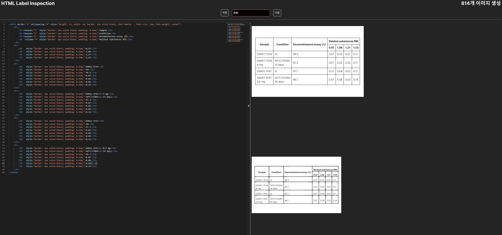
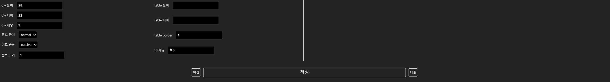

# HTML 테이블 라벨링 검수

Vision LLM 전용 데이터를 만들기 위한 레이블링 검수 및 생성 툴

[백엔드 레포](https://github.com/h06-Cpy/html_label_inspect_backend)

## Layout

- 좌상단: monaco 에디터
- 좌하단: div 및 table 태그 스타일 조정
- 우상단: monaco 에디터에 있는 html 렌더링 결과
- 우하단: 렌더링된 html을 이미지로 변환한 결과

맨 마지막 저장 버튼을 통해 렌더링된 이미지를 서버에 저장

## Tech Stack
- Typescript
- React.JS
- Tailwind CSS
---

yarn libraries
- [Axios](https://axios-http.com/docs/intro)
- [Monaco editor React](https://www.npmjs.com/package/@monaco-editor/react)
- [html2canvas](https://html2canvas.hertzen.com/)
